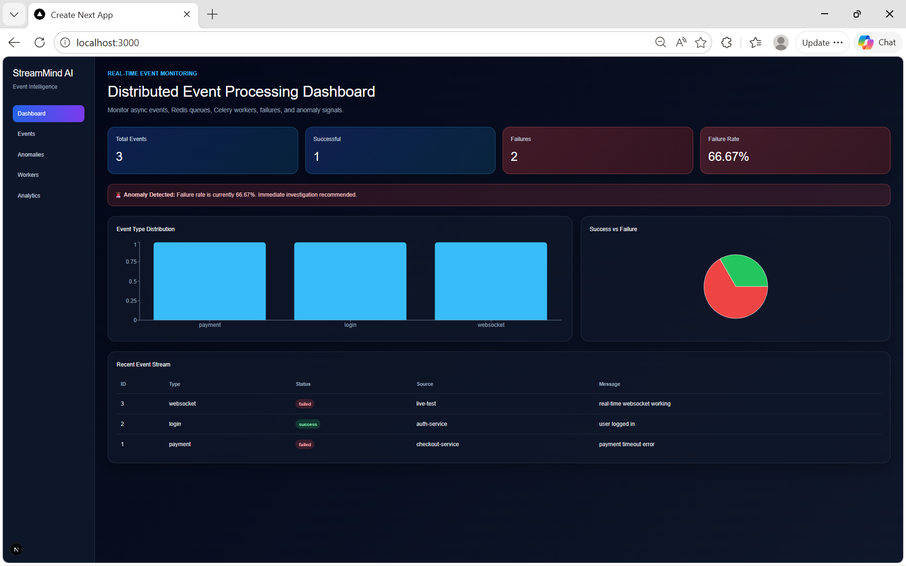
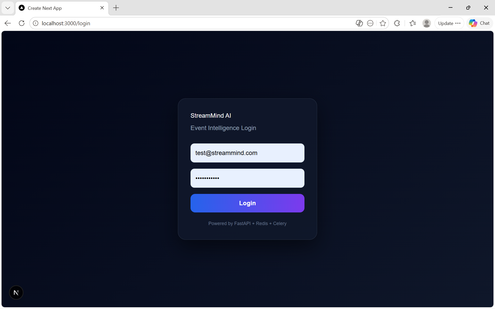
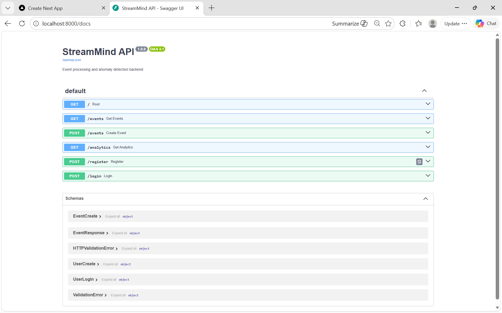

## Repository

This project demonstrates a real-time, event-driven architecture with asynchronous processing, live dashboard updates, authentication, and containerized deployment.

---

## Live Demo

Frontend: https://streammind-ai.vercel.app

Note: The frontend is deployed on Vercel. For full backend functionality, run the backend locally using Docker or connect it to the deployed Render backend.

---

# StreamMind AI — Real-Time Event Intelligence Platform

StreamMind AI is a full-stack, real-time event monitoring system designed to model modern distributed architectures. It processes events asynchronously, performs analytics, detects anomalies, and streams live updates to a web dashboard using WebSockets.

The system demonstrates backend scalability patterns, event-driven design, and real-time UI synchronization commonly used in production systems.

---

## Overview

This project simulates an event pipeline where incoming events are processed asynchronously and visualized in real time. It integrates background workers, message queues, and a live frontend to provide an end-to-end monitoring solution.

---

## Key Features

### Asynchronous Event Processing
- Events are handled using Celery workers
- Background processing decouples ingestion from execution
- Supports scalable task execution patterns

### Real-Time Updates
- Uses Redis Pub/Sub for event propagation
- FastAPI WebSocket endpoint streams updates to frontend
- Eliminates polling by pushing updates instantly

### Analytics Dashboard
- Displays total, successful, and failed events
- Calculates failure rate dynamically
- Visualizes data using charts (Recharts)

### Anomaly Detection
- Detects abnormal failure rates in real time
- Triggers alert banner in dashboard
- Demonstrates basic monitoring logic used in production

### Authentication
- JWT-based login and registration
- Password hashing using bcrypt
- Protected frontend routes using token validation

### Containerized Architecture
- Fully Dockerized using Docker Compose
- Independent services for frontend, backend, worker, and Redis
- Simplifies local development and deployment

---

## System Architecture

Frontend (Next.js)  
⬇  
FastAPI Backend  
⬇  
Redis (Pub/Sub + Queue)  
⬇  
Celery Workers  

---

## Tech Stack

### Backend
- FastAPI
- SQLAlchemy
- Celery
- Redis
- Python-JOSE (JWT)
- Passlib (bcrypt)

### Frontend
- Next.js (App Router)
- React
- Recharts

### Infrastructure
- Docker
- Docker Compose

---

## How It Works

1. Client sends an event via API (`POST /events`)
2. Event is queued and processed by Celery worker
3. Worker stores event in database
4. Worker publishes event to Redis channel
5. FastAPI listens to Redis and broadcasts via WebSocket
6. Frontend receives event and updates UI instantly

---

## Running Locally

### Prerequisites
- Docker installed

### Start the application

docker compose up --build

---

### Access

Frontend:
http://localhost:3000

Backend:
http://localhost:8000/docs

---

## API Endpoints

### Auth
- POST /register
- POST /login

### Events
- POST /events
- GET /events

### Analytics
- GET /analytics

### WebSocket
- /ws/events

---

## Example Event
{
"event_type": "payment",
"status": "failed",
"source": "checkout-service",
"message": "payment timeout error"
}

---

## Demo

### Dashboard

### Login

### API

---

## Key Highlights

- Event-driven architecture using Redis and Celery
- Real-time updates using WebSockets
- Full-stack system with clear separation of concerns
- Authentication and protected routes
- Fully Dockerized

---

## Future Improvements

- Role-based authentication
- Event filtering and search
- Kafka integration
- Cloud deployment
- Monitoring (Prometheus, Grafana)

---

## Author

Prerana Puttaswamy
